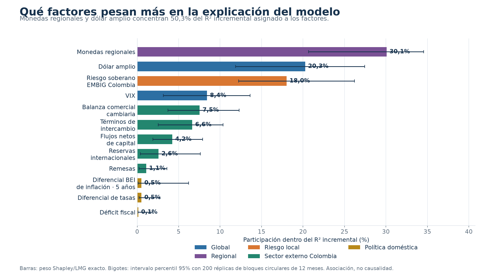
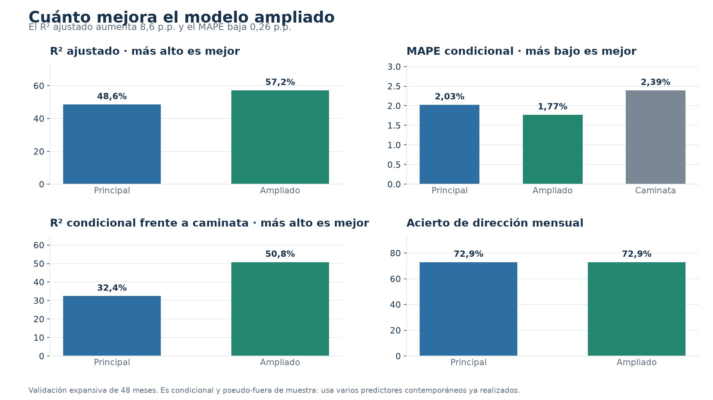
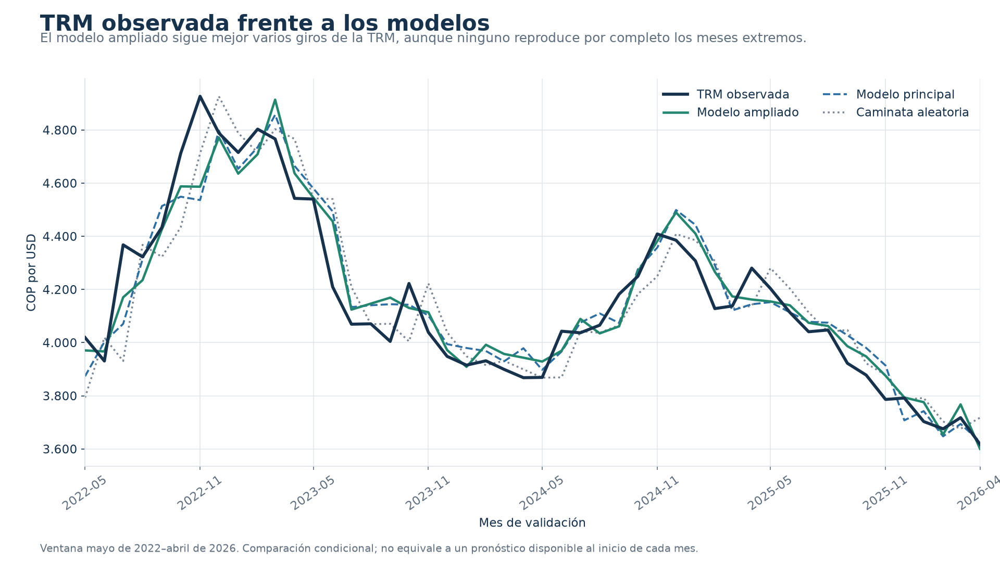
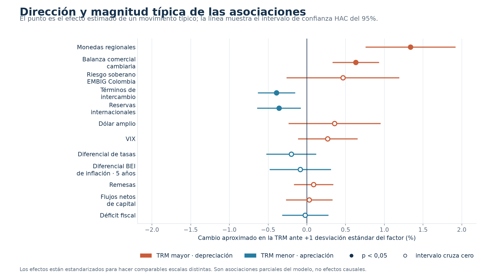
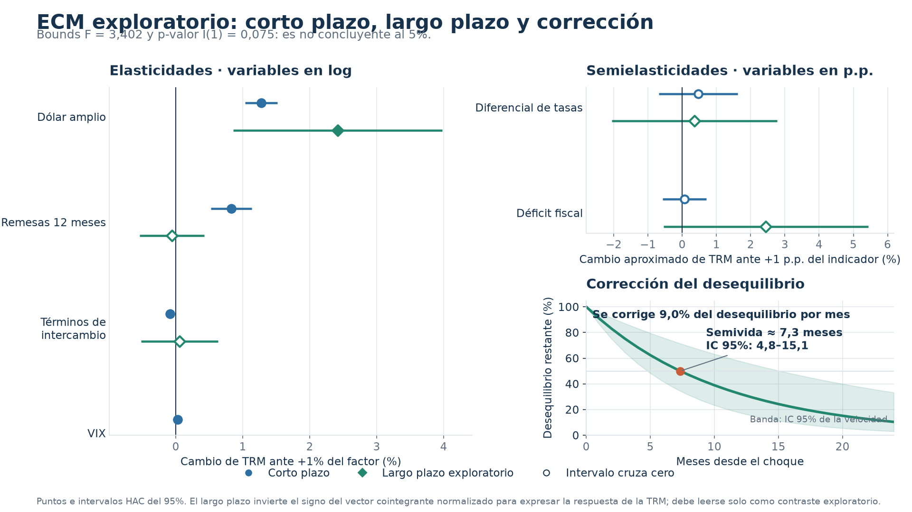

# Gráficos explicativos del modelo de TRM

Esta carpeta presenta cinco lecturas visuales del modelo fuera del archivo Excel. Cada imagen se reconstruye con `python src/build_charts.py` a partir de los CSV versionados en `results/`; no contiene cifras digitadas manualmente. `metadata.json` registra las huellas de las fuentes y del generador, y `python src/check_charts.py` verifica que los PNG estén sincronizados. Los CSV se normalizan a seis cifras significativas antes de calcular la huella: es una precisión mayor que la visible en las imágenes y tolera diferencias numéricas irrelevantes entre plataformas sin ocultar cambios materiales.

## 1. Peso explicativo de los factores

Ordena los 12 factores por su participación en el R² incremental asignado mediante Shapley/LMG. Los bigotes añaden intervalos percentiles del 95% obtenidos con 200 réplicas de bloques circulares de 12 meses. Los pesos suman 100% dentro del bloque de factores. No son porcentajes causales del precio del dólar: dependen de la muestra, la especificación y la información compartida entre variables correlacionadas.

## 2. Comparación de desempeño

Separa el desempeño de la explicación histórica y el pronóstico con rezagos de publicación. También compara el MAPE del pronóstico con la caminata aleatoria y muestra que el R² de pronóstico frente a ese benchmark es negativo. Cada panel identifica si usa información contemporánea o disponible al origen.

## 3. TRM observada y comparadores

Muestra la TRM observada, las estimaciones condicionales principal y ampliada, el pronóstico con información rezagada y la caminata aleatoria durante los 48 meses de validación. Las dos primeras explican con realizaciones contemporáneas; la tercera respeta el calendario de publicación, aunque usa el último *vintage* disponible.

## 4. Dirección y magnitud típica

Estandariza cada regresor a un movimiento de una desviación estándar para comparar variables con unidades diferentes. Un punto a la derecha se asocia con depreciación del COP y uno a la izquierda, con apreciación. Las líneas son intervalos HAC del 95%; un punto vacío indica que el intervalo cruza cero.

Este gráfico responde una pregunta distinta al peso Shapley. El efecto estandarizado muestra dirección, magnitud parcial e incertidumbre del coeficiente completo; Shapley distribuye la capacidad explicativa, incluida la señal compartida. Por eso un factor puede tener peso visible y un coeficiente impreciso.

## 5. ECM: corto plazo, largo plazo y ajuste

Separa tres conceptos que no deben mezclarse:

- Las variables en logaritmos se muestran como elasticidades: cambio porcentual aproximado de la TRM ante un aumento de 1% del factor.
- El VIX aparece solo en corto plazo porque el ECM lo incorpora como cambio contemporáneo, no dentro del vector de niveles.
- El diferencial de tasas y el déficit se muestran como semielasticidades: en corto plazo corresponden a un cambio mensual de 1 punto porcentual y en largo plazo a una diferencia de 1 punto porcentual en el nivel de equilibrio.
- La curva inferior muestra qué proporción de un desequilibrio inicial permanecería después de cada mes. La anotación calcula la velocidad de ajuste y la semivida a partir del coeficiente de corrección vigente; la banda transforma su intervalo del 95%.

El bosque de elasticidades incluye términos de intercambio tanto en corto como en largo plazo. El riesgo soberano EMBIG Colombia y el diferencial de compensación inflacionaria a cinco años pertenecen al modelo ampliado, pero no al vector ECM; por eso aparecen en los gráficos de pesos y efectos típicos, no en este bosque.

El CSV de largo plazo contiene el vector cointegrante normalizado con coeficiente 1 para `ln_trm`. Para expresar la respuesta de equilibrio de la TRM, el gráfico invierte el signo de los términos explicativos y también invierte los extremos de sus intervalos. El subtítulo interpreta la prueba bounds con ambos límites al 5%; salvo que se rechace el límite superior I(1), los valores de largo plazo deben leerse como exploratorios y no como evidencia confirmada de equilibrio.

## Cautelas comunes

- Los cinco gráficos describen asociaciones estadísticas, no causalidad.
- Términos de intercambio, dólar amplio, VIX, EMBIG Colombia y monedas regionales usan información contemporánea realizada.
- El factor histórico usa BRL, CLP, MXN y PEN; el pronóstico usa BRL, CLP y MXN porque obtiene menor BIC. PEN mejora el ajuste histórico, no el desempeño ex ante.
- La evaluación con rezagos sigue siendo pseudo-tiempo-real: el archivo hacia adelante está activo, pero 0 de 12 factores tienen cobertura histórica versionada completa para los 48 orígenes.
- En el modelo ampliado, balanza, capitales, reservas, remesas, tasas, déficit y el diferencial de compensación inflacionaria entran rezagados, pero aun así pueden compartir choques o responder indirectamente a la propia TRM.
- El diferencial BEI a cinco años se construye con compensaciones de mercado: combina inflación esperada con primas por riesgo inflacionario y diferencias de liquidez entre bonos nominales e indexados; no es una expectativa pura.
- EMBIG Colombia mide una prima de riesgo soberano de mercado; su coeficiente contemporáneo también puede recoger liquidez y aversión global al riesgo.
- La balanza comercial tiene signo estimado positivo, contrario al esperado; esto puede reflejar simultaneidad o composición de los flujos.
- ARCH-LM y Jarque–Bera alertan sobre volatilidad condicional y colas no normales; RESET no rechaza la forma funcional al 5% en el ampliado.
